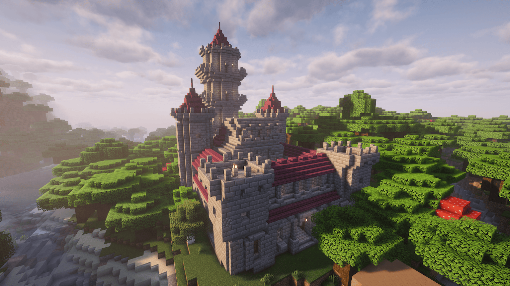

# Castle Shift

**A structure mod that adds castles to Minecraft's world generation**

A multi-loader Minecraft mod that generates multi-story stone brick castles across the landscape. Each castle features randomized structural variations, so no two castles are exactly alike.



*More screenshots available on [CurseForge](https://www.curseforge.com/minecraft/mc-mods/castle-shift) and [Modrinth](https://modrinth.com/mod/castle-shift)*

## Features

- **Multi-Story Castles**: Grand 4-floor castles with walls, towers, and corridors
- **Randomized Materials**: Roofs, walls, and stairs are each built from materials randomly selected per castle, producing a wide range of appearances
  - **Roofs**: Spruce, Dark Oak, Deepslate Bricks, Dark Prismarine, Red Nether Bricks, Crimson
  - **Walls**: Stone Bricks, Deepslate Bricks, Polished Blackstone Bricks, Sandstone, End Stone Bricks
  - **Stairs**: Bricks, Stone Bricks, Polished Granite, Deepslate Bricks, Polished Blackstone, Polished Blackstone Bricks, Red Nether Bricks
- **Structural Variations**: Each floor section (walls, corners, centers, towers) has multiple structure templates chosen at random
- **Wall Weathering**: Stone brick and polished blackstone brick walls may randomly degrade into cobblestone, andesite, or cracked variants for a lived-in look
- **Natural Placement**: Castles generate organically in a wide variety of biomes
- **Datapack-Friendly**: Structure placement can be customized via datapacks (spacing, separation, biome filters)

## Supported Versions

| Minecraft | Fabric | NeoForge | Forge |
|-----------|--------|----------|-------|
| 1.21.11 | Yes | Yes | Yes |
| 1.21.10 | Yes | Yes | Yes |
| 1.21.9 | Yes | Yes | Yes |
| 1.21.8 | Yes | Yes | Yes |
| 1.21.7 | Yes | Yes | Yes |
| 1.21.6 | Yes | Yes | Yes |
| 1.21.5 | Yes | Yes | Yes |
| 1.21.4 | Yes | Yes | Yes |
| 1.21.3 | Yes | Yes | Yes |
| 1.21.2 | Yes | Yes | — |
| 1.21.1 | Yes | Yes | Yes |
| 1.20.1 | Yes | — | Yes |

## Requirements

### For Players
- **Minecraft**: Java Edition (see [Supported Versions](#supported-versions))
- **Mod Loader** (choose one for your Minecraft version):
  - **Fabric**: Fabric Loader 0.17.3+ (1.21.x) or 0.16.10+ (1.20.1), with corresponding Fabric API
  - **NeoForge**: Available for 1.21.1–1.21.11
  - **Forge**: Available for 1.20.1 and 1.21.1–1.21.11 (except 1.21.2)

### For Developers
- **Java Development Kit (JDK)**: 21 or higher
- **IDE**: IntelliJ IDEA (recommended) or Eclipse

## Building from Source

```bash
git clone https://github.com/ksoichiro/CastleShift.git
cd CastleShift
./gradlew build
```

**Build for a specific version**:
```bash
./gradlew build -Ptarget_mc_version=1.21.4
```

**Output Files** (example for 1.21.4):
- `fabric/1.21.4/build/libs/castleshift-0.1.0+1.21.4-fabric.jar` - Fabric loader JAR
- `neoforge/1.21.4/build/libs/castleshift-0.1.0+1.21.4-neoforge.jar` - NeoForge loader JAR
- `forge/1.21.4/build/libs/castleshift-0.1.0+1.21.4-forge.jar` - Forge loader JAR

**Multi-version tasks**:
```bash
./gradlew buildAll       # Build all versions
./gradlew cleanAll       # Clean all versions
./gradlew release        # cleanAll + buildAll + collectJars
```

## Development Setup

### Import to IDE

#### IntelliJ IDEA (Recommended)
1. Open IntelliJ IDEA
2. File -> Open -> Select `build.gradle` in project root
3. Choose "Open as Project"
4. Wait for Gradle sync to complete

### Run in Development Environment

```bash
# Fabric client (default version: 1.21.1)
./gradlew fabric:runClient

# NeoForge client
./gradlew neoforge:runClient

# Forge client
./gradlew forge:runClient

# Specify a different version
./gradlew fabric:runClient -Ptarget_mc_version=1.21.4
./gradlew forge:runClient -Ptarget_mc_version=1.20.1
```

## Installation

1. Install the desired Minecraft version (see [Supported Versions](#supported-versions))
2. Install a supported mod loader for that version:
   - **Fabric**: Install Fabric Loader, then download the matching Fabric API
   - **NeoForge**: Install the matching NeoForge version
   - **Forge**: Install the matching Forge version
3. Download the Castle Shift JAR for your Minecraft version and mod loader from [Modrinth](https://modrinth.com/mod/castle-shift) or [CurseForge](https://www.curseforge.com/minecraft/mc-mods/castle-shift)
4. Copy the JAR to your `.minecraft/mods/` folder
5. Launch Minecraft with the corresponding mod loader profile

## Project Structure

```
CastleShift/
├── common/
│   ├── shared/              # Shared version-agnostic sources (included via srcDir)
│   ├── 1.21.1/              # Common module for MC 1.21.1 (also used by 1.21.2–1.21.11)
│   │   └── src/main/
│   │       ├── java/com/castleshift/
│   │       │   ├── CastleShift.java       # Common entry point
│   │       │   ├── processor/             # Structure processors
│   │       │   └── worldgen/              # World generation
│   │       └── resources/
│   │           ├── data/castleshift/      # Structures, worldgen config
│   │           └── assets/castleshift/    # Textures, lang files
│   └── 1.20.1/              # Common module for MC 1.20.1
├── fabric/
│   ├── base/                # Shared Fabric sources
│   ├── 1.21.1/              # Fabric subproject for MC 1.21.1
│   ├── 1.21.2/ ... 1.21.11/ # Fabric subprojects for other 1.21.x versions
│   └── 1.20.1/              # Fabric subproject for MC 1.20.1
├── neoforge/
│   ├── base/                # Shared NeoForge sources
│   ├── 1.21.1/              # NeoForge subproject for MC 1.21.1
│   └── 1.21.2/ ... 1.21.11/ # NeoForge subprojects for other 1.21.x versions
├── forge/
│   ├── base/                # Shared Forge sources
│   ├── base-56/             # Forge 56+ sources (MC 1.21.6+, EventBus 7)
│   ├── 1.21.1/              # Forge subproject for MC 1.21.1 (ForgeGradle)
│   ├── 1.21.3/ ... 1.21.11/ # Forge subprojects for other 1.21.x versions
│   └── 1.20.1/              # Forge subproject for MC 1.20.1 (Architectury Loom)
├── props/                   # Version-specific properties
├── scripts/                 # Build and release scripts
├── build.gradle             # Root build configuration (Groovy DSL)
├── settings.gradle          # Multi-module settings
└── gradle.properties        # Version configuration
```

## Technical Notes

- **Build DSL**: Groovy DSL (for Architectury Loom compatibility)
- **Mappings**: Mojang mappings (official Minecraft class names)
- **Shadow Plugin**: Bundles common module into loader-specific JARs
- **Structure Files**: NBT format, placed in `common/{version}/src/main/resources/data/castleshift/structure/`
- **NBT Conversion**: Automatic 1.21.1 -> 1.20.1 structure conversion via build script

## License

This project is licensed under the **GNU Lesser General Public License v3.0 (LGPL-3.0)**.

Copyright (C) 2026 Soichiro Kashima

See the [COPYING](COPYING) and [COPYING.LESSER](COPYING.LESSER) files for full license text.

## Credits

- Built with [Architectury Loom](https://github.com/architectury/architectury-loom) and [ForgeGradle](https://github.com/MinecraftForge/ForgeGradle)

## Support

For issues, feature requests, or questions:
- Open an issue on [GitHub Issues](https://github.com/ksoichiro/CastleShift/issues)

---

**Developed for Minecraft Java Edition 1.20.1 / 1.21.1–1.21.11**
